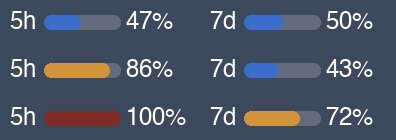

# clawdbar

> Claude usage in your menu bar — in Claude's own exact colors.


A tiny [SwiftBar](https://github.com/swiftbar/SwiftBar) plugin that shows your **Claude Code 5-hour and 7-day rate-limit usage** in the macOS menu bar, as mini progress bars painted in Claude's **official, pixel-perfect colors**.



White text (so it blends in with your other menu-bar items) + a colored bar per window:

| Usage | Bar color | Meaning |
|------|-----------|---------|
| `< 70%`  | 🔵 blue `#3A6DCB`     | normal |
| `70–99%` | 🟡 gold `#D1933C`     | approaching limit |
| `100%`   | 🔴 dark red `#7F2C28` | capped |

These three hex values were sampled **pixel-perfect from the official claude.ai usage screen** — not guessed. The 70% line is exactly where Claude's own `allowed_warning` state kicks in.

## Why "clawdbar"?

`clawd` is the internal pet-name for Claude buried in Claude Code's own source — the menu-bar text color token in there is literally called `clawd_body`. This plugin lives in your menu **bar**, so: **clawdbar**. 🐾

## How it works

- Same data as Claude Code's `/usage`, straight from the official endpoint:
  `GET https://api.anthropic.com/api/oauth/usage` → `five_hour` / `seven_day` `utilization` + `resets_at`.
- Auth reuses your existing Claude Code OAuth token, read **locally** from the macOS Keychain (`Claude Code-credentials`). Nothing leaves your machine except the call to `api.anthropic.com`; the script writes no token to disk.
- A small Python/Pillow snippet draws the progress-bar PNG and hands it to SwiftBar via `| image=`.

## Requirements

- macOS + [SwiftBar](https://github.com/swiftbar/SwiftBar) (`brew install --cask swiftbar`)
- An active **Claude Pro / Max** subscription, logged in via Claude Code (`claude`)
- `python3` with **Pillow** (`pip3 install Pillow`)

## Install

```bash
brew install --cask swiftbar
pip3 install Pillow

mkdir -p ~/SwiftBarPlugins
cp clawdbar.5m.sh ~/SwiftBarPlugins/
chmod +x ~/SwiftBarPlugins/clawdbar.5m.sh
```

Then in SwiftBar → **Change Plugin Folder…** → pick `~/SwiftBarPlugins` (SwiftBar is sandboxed, so it needs you to select the folder once to grant access). On first run, click **Always Allow** when macOS asks for Keychain access.

> The `5m` in the filename = refresh every 5 minutes. The usage endpoint rate-limits hard — don't go lower.

## Notes

- **Why an image instead of colored text?** SwiftBar doesn't support 24-bit truecolor ANSI in menu-bar titles — a `\033[38;2;r;g;bm` sequence gets mis-parsed and can even break rendering. Plain text is stuck with the 16-color ANSI palette, which can't reproduce `#3A6DCB` & co. Drawing a PNG is the only way to hit the exact official colors.
- The dropdown shows each window's reset time + countdown and a **Refresh now** button.
- **Behind a proxy / in a geo-blocked region?** Anthropic returns `forbidden / "Request not allowed"` on direct connections from some regions, and SwiftBar doesn't inherit your shell's `http(s)_proxy` vars. The plugin reads your **macOS system proxy** (`scutil --proxy`) and routes the API call through it — so it just works as long as your VPN/proxy is set as the system proxy. Turn the proxy off and it falls back to a direct connection.
- Tweak colors / thresholds / layout in `draw_icon()` inside the script.

## License

MIT — see [LICENSE](LICENSE).
